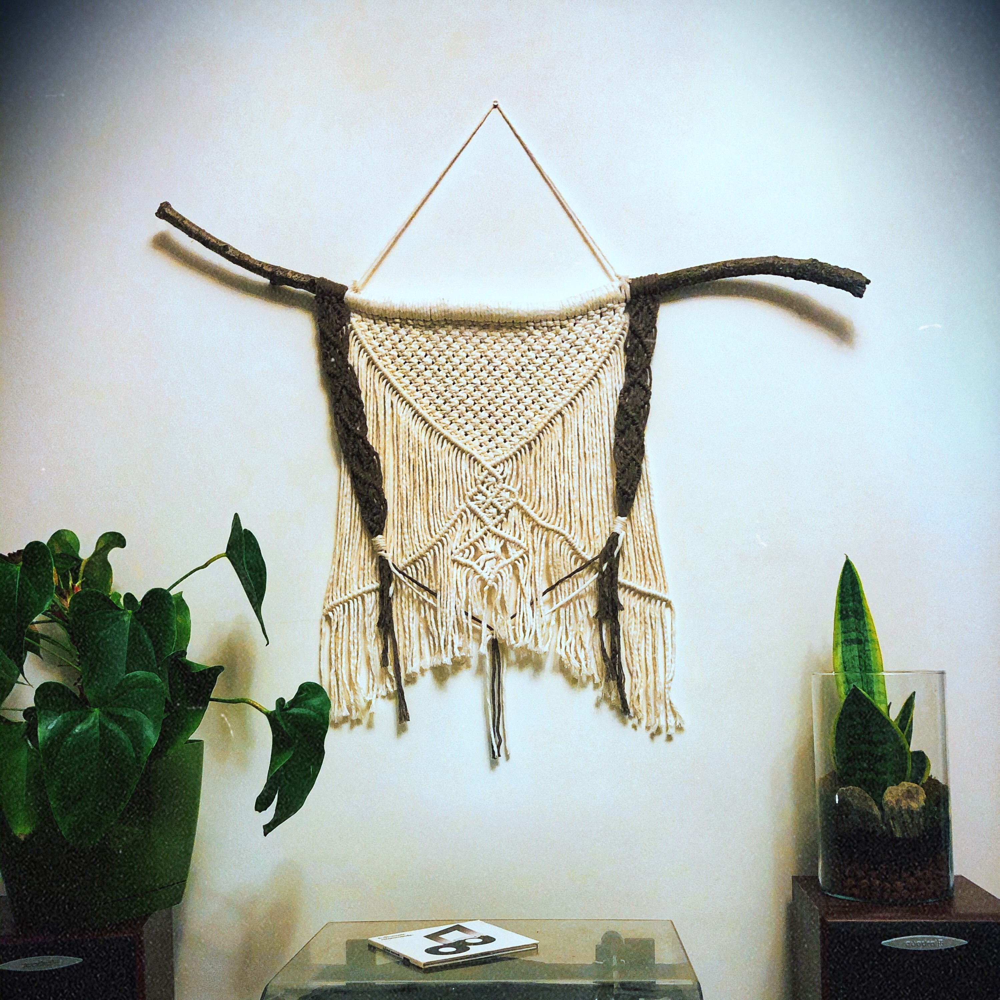
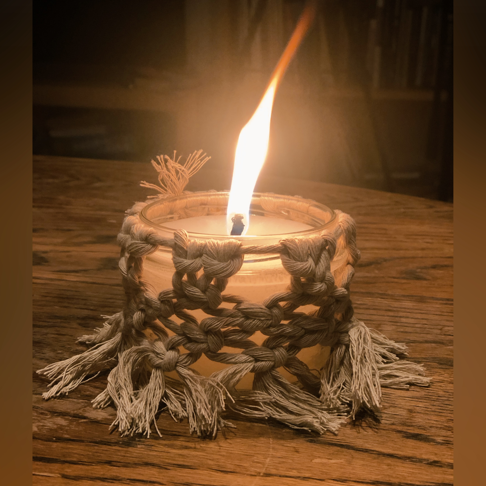

<!DOCTYPE html>
<html lang="en">
<head>
  <meta charset="UTF-8">
  <meta name="viewport" content="width=device-width, initial-scale=1.0">
  <meta http-equiv="X-UA-Compatible" content="ie=edge">
  <link rel="preconnect" href="https://fonts.gstatic.com">
<link href="https://fonts.googleapis.com/css2?family=Roboto+Condensed:wght@300&display=swap" rel="stylesheet">
<link rel="stylesheet" href="css/style.css">
  <title>MALA online</title>
</head>

<body>
  <header>
    <nav id="navbar">
      

        <h1 class="logo"><a href="index.html">MALA online</a></h1>
        <ul>
          <li><a class="current" href="index.html">Blog</a></li>
          <li><a href="https://allegrolokalnie.pl/konto/oferty/aktywne">Allegro</a></li>
          <li><a href="https://www.instagram.com/malaonline.pl/">Instagram</a></li>
        </ul>
      

    </nav>

    

      

        

          <h1>MALA online</h1>
          
Tworzymy makramy, świece aromaterapeutyczne, piszemy o jodze, tworzymy muzykę medytacyjną. Organizujemy warsztaty.

          <a class="btn" href="#testimonials">Nasze produkty</a>
        

      

    

  </header>
  <section id="testimonials" class="py-3">
    

      <h2 class="l-heading">Nasze produkty</h2>
      

        
        <h2>Makramy Naścienne</h2>
         
Makramy i łapacze snów są wyplatane ręcznie. Możliwe jest zamówienie indywidualnego wzoru lub wybranie jednego z wcześniej wyplecionych. Rozmiary: od 40 cm długości do 100 cm.
Świetnie wkomponowują się do salonu i sypialni.
  
Cena: od 50 zł do 150 zł. 

      

      

          
          <h2> Świece Aromaterapeutyczne</h2>
          
 
 Świece palą się 8h i wykonane są metodą rzemieślniczą z dodatkiem zdrowotnych olejów z eukaliptusa, lawendy, sosny i trawy cytrynowej. Bez dodatku chemii, tylko naturalne składniki. Są oplecione makamowymi sznurkami ( po pierwsze - chronią przed oparzeniem, po drugie - dodają element boho do pomieszczenia, w którym są zapalane).

Mogą być używane do aromaterapii. Prozdrowotne olejki pomagają w chorobach oddechowych. Sprawdzone na dzieciach i alergikach w warunkach domowych.

  
Cena jednej sztuki: 10 zł. 25 zł w zestawie (3 sztuki).

 

    

  </section>
<footer id="main-footer">
      
  
MALA ONLINE &copy; 2021, All RIghts Reserved

  </footer>

</body>
</html>
